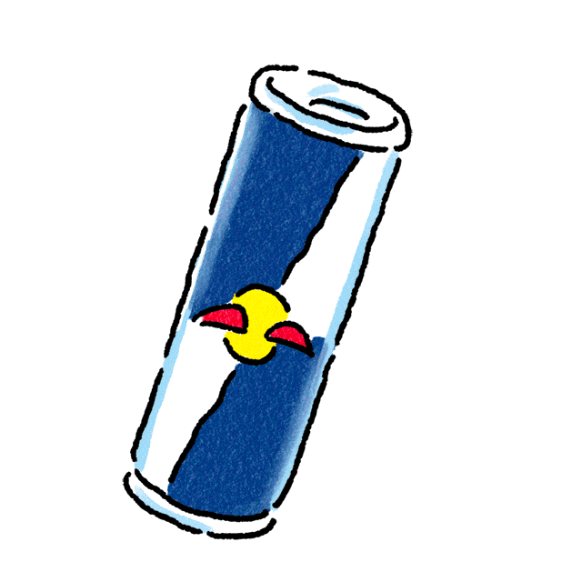

 

## Hi, I'm Lex 👨🏾‍💻👋🏾

I'm Lex, a self-taught UI designer, full stack engineer, and software developer :unicorn:

Red Bull in one hand, mouse in the other, I'm also the brains and brawn behind [Flex Development][1] :brain::mechanical_arm:

### Languages, frameworks, and tools (oh my!)

### GitHub Stats

[1]: https://github.com/flex-development
